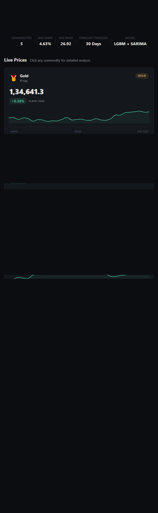
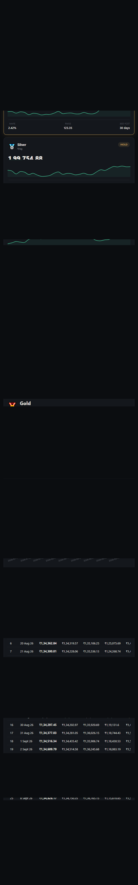
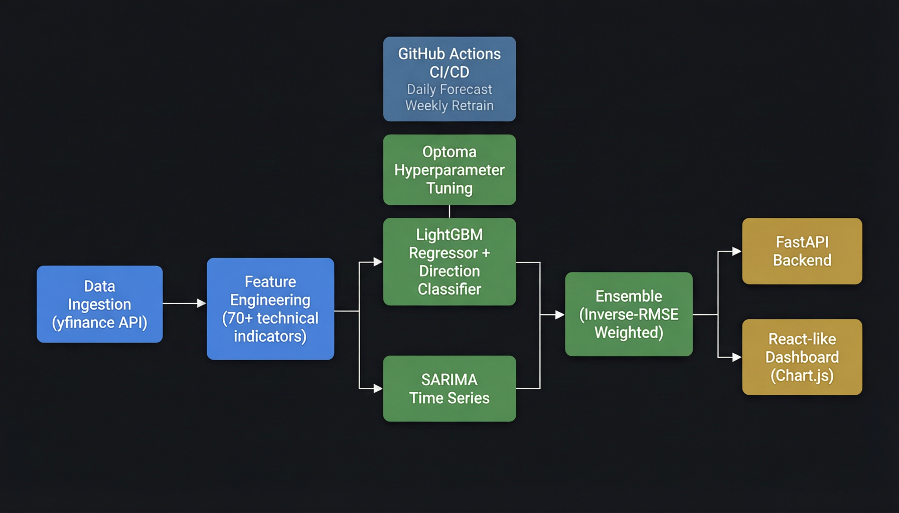

<p align="center">
  
  
  
  
  
  
  
  
</p>

<h1 align="center">Multi-Commodity Price Forecaster</h1>

<p align="center">
  <strong>End-to-end ML system that predicts 30-day prices for Gold, Silver, Crude Oil, Natural Gas & Copper<br/>
  using a LightGBM + SARIMA ensemble with direction-aware classification</strong>
</p>

<p align="center">
  <em>Recursive multi-day forecasting &bull; 200+ engineered features &bull; Optuna-tuned hyperparameters &bull; Automated CI/CD pipeline</em>
</p>

---

## Dashboard Preview

<p align="center">
  
</p>

<p align="center">
  
</p>

<p align="center">
  
</p>

---

## Table of Contents

- [Overview](#overview)
- [Architecture](#architecture)
- [Key Features](#key-features)
- [Commodities Tracked](#commodities-tracked)
- [Model Architecture](#model-architecture)
- [Tech Stack](#tech-stack)
- [Project Structure](#project-structure)
- [Pipeline Flow](#pipeline-flow)
- [Getting Started](#getting-started)
- [CI/CD Automation](#cicd-automation)
- [Testing](#testing)
- [Model Performance](#model-performance)
- [Key Design Decisions](#key-design-decisions)
- [Future Roadmap](#future-roadmap)
- [License](#license)

---

## Overview

This project is a **production-grade machine learning forecasting system** that predicts daily and monthly prices for five globally traded commodities in Indian Rupees (INR). It combines gradient-boosted trees (LightGBM) with classical time-series models (SARIMA) into a dynamically weighted ensemble, enhanced with a binary direction classifier to improve up/down prediction accuracy.

The system is designed to run **autonomously** via GitHub Actions — fetching fresh market data every weekday, generating updated forecasts, and retraining models weekly — all without manual intervention.

### What Makes This Different

| Feature | Typical Projects | This Project |
|---|---|---|
| Forecasting approach | Single model, direct prediction | Ensemble (LGBM + SARIMA), recursive multi-day |
| Feature engineering | 10-20 basic features | **200+ features** including cross-commodity ratios, directional signals |
| Hyperparameter tuning | Grid search / random | **Optuna Bayesian optimization** targeting directional accuracy |
| Direction prediction | Regression sign only | **Dedicated LGBM classifier** blended with regression |
| Deployment | Jupyter notebook | **FastAPI backend + interactive dashboard + CI/CD** |
| Automation | Manual re-runs | **Daily forecasts + weekly retraining via GitHub Actions** |
| Confidence intervals | Not included | **RMSE-based expanding confidence bands** |
| Trading signals | Not included | **BUY/SELL/HOLD recommendations** based on error-margin analysis |

---

## Architecture

<p align="center">
  
</p>

### System Components

```
┌─────────────────────────────────────────────────────────────────┐
│                    GITHUB ACTIONS (CI/CD)                        │
│  ┌─────────────────────┐    ┌──────────────────────────────┐   │
│  │ Daily Forecast       │    │ Weekly Retrain                │   │
│  │ Mon-Fri 11:00 PM IST │    │ Sunday 11:30 PM IST          │   │
│  │ ingestion → features │    │ ingestion → features → train  │   │
│  │ → save_forecasts     │    │ → optuna → save_forecasts    │   │
│  └──────────┬──────────┘    └──────────────┬───────────────┘   │
└─────────────┼──────────────────────────────┼───────────────────┘
              │                              │
              ▼                              ▼
┌─────────────────────────────────────────────────────────────────┐
│                    DATA PIPELINE                                 │
│                                                                  │
│  yfinance API ──▶ data/raw/ ──▶ Feature Engineering (200+)      │
│  (GC=F, SI=F,      (CSVs)      ├── Technical Indicators        │
│   CL=F, NG=F,                    ├── Cross-Commodity Ratios     │
│   HG=F, INR=X)                   ├── Directional Features       │
│                                  └── Time/Seasonality           │
│                                         │                        │
│                                         ▼                        │
│                              data/processed/ (CSV)               │
└──────────────────────────────────────────┼───────────────────────┘
                                           │
              ┌────────────────────────────┼────────────────────┐
              ▼                            ▼                    ▼
┌────────────────────┐  ┌──────────────────────┐  ┌──────────────────┐
│  LightGBM          │  │  SARIMA              │  │  Optuna          │
│  ├── Regressor     │  │  (1,1,1)(1,1,1,12)  │  │  Bayesian HP     │
│  └── Dir.Classifier│  │                      │  │  Tuning          │
└────────┬───────────┘  └──────────┬───────────┘  └──────────────────┘
         │                         │
         ▼                         ▼
┌─────────────────────────────────────────────────────────────────┐
│                    ENSEMBLE ENGINE                                │
│  Inverse-RMSE Weighted: w_lgbm * LGBM + w_sarima * SARIMA      │
│  + Direction Classifier Blending                                 │
└────────────────────────────┬────────────────────────────────────┘
                             │
              ┌──────────────┼──────────────┐
              ▼              ▼              ▼
┌──────────────────┐ ┌──────────────┐ ┌──────────────────────┐
│  FastAPI Backend  │ │  JSON Output │ │  Backtest Plots      │
│  GET /forecasts  │ │  forecasts   │ │  (matplotlib)        │
│  GET /{commodity}│ │  .json       │ │                      │
└────────┬─────────┘ └──────┬───────┘ └──────────────────────┘
         │                   │
         ▼                   ▼
┌─────────────────────────────────────────────────────────────────┐
│                    FRONTEND DASHBOARD                             │
│  Chart.js Visualizations ├── History (Blue) + Forecast (Green)  │
│  Interactive Cards       ├── Confidence Bands                   │
│  Forecast Tables         ├── Model Comparison (LGBM vs SARIMA)  │
│  BUY/SELL/HOLD Signals   └── Timeframe Filtering (1M-5Y)       │
└─────────────────────────────────────────────────────────────────┘
```

---

## Key Features

### Data & Feature Engineering
- **Real-time data ingestion** from Yahoo Finance via `yfinance` — commodity futures + USD/INR exchange rate
- **200+ engineered features** per commodity:
  - Technical indicators: RSI(14), MACD(12/26/9), Bollinger Bands(20), EMA(9/21/50/200), ATR(14)
  - 8 lag features + 6 rolling windows (7/14/30/60/90/180 day)
  - Multi-timeframe momentum (3/7/14/30/60 day percentage returns)
  - Explicit directional features: trend flags, EMA crossover direction, gap returns
  - RSI regime zones (oversold/overbought), MACD histogram direction
  - Consecutive direction streaks, volatility regime ratios
  - Day-of-week average historical returns (weekly seasonality)
  - Cross-commodity ratios: Gold/Silver, Oil/Gas, Copper/Gold
- **USD to INR conversion** with commodity-specific formulas (oz→10g, oz→kg, lb→kg, direct)
- **Monthly aggregation** for longer-term (36-month) forecasting

### Model Architecture
- **LightGBM Regressor** — predicts next-day percentage returns (not raw prices)
- **LightGBM Direction Classifier** — binary UP/DOWN prediction, blended with regression to sharpen directional accuracy
- **SARIMA(1,1,1)(1,1,1,12)** — captures trend and 12-period seasonality on price levels
- **Dynamic Ensemble** — inverse-RMSE weighted combination (weights earned from test performance, not guessed)
- **Recursive Forecasting** — each prediction feeds back into feature engineering for the next day

### Hyperparameter Optimization
- **Optuna Bayesian search** over 9 hyperparameters (50 trials per commodity)
- **Objective**: maximize directional accuracy with RMSE as tiebreaker
- **TimeSeriesSplit** cross-validation (3 folds) — respects temporal ordering
- Per-commodity tuned parameters saved to `models/optuna/tuned_lgbm_params.json`

### Dashboard & API
- **Dark-theme professional dashboard** built with Chart.js
  - Commodity cards with sparklines, metrics, and BUY/SELL/HOLD signals
  - Expanded detail view with history (blue) + forecast (green) + confidence band
  - LightGBM vs SARIMA model comparison lines
  - Timeframe selector: 1M, 3M, 6M, 1Y, 3Y, Max
  - 30-day forecast breakdown table with all model predictions
- **FastAPI backend** with 3 REST endpoints, CORS support, model caching
- **Confidence intervals** that widen over the forecast horizon (RMSE-based)

### DevOps & Automation
- **GitHub Actions** daily forecast pipeline (Mon-Fri) + weekly model retrain (Sunday)
- **33-test pytest suite** covering data integrity, feature correctness, model artifacts, forecast sanity
- **Git-tracked models** (LightGBM < 6 MB each) with SARIMA refit at runtime (491 MB files excluded)
- **Structured logging** across all pipeline stages

---

## Commodities Tracked

| Commodity | Ticker | Unit (INR) | Sector | Conversion Formula |
|---|---|---|---|---|
| Gold | `GC=F` | ₹/10g | Precious Metal | USD/oz × USDINR / 3.11035 |
| Silver | `SI=F` | ₹/kg | Precious Metal | USD/oz × USDINR × 32.1507 |
| Crude Oil | `CL=F` | ₹/barrel | Energy | USD × USDINR (direct) |
| Natural Gas | `NG=F` | ₹/MMBtu | Energy | USD × USDINR (direct) |
| Copper | `HG=F` | ₹/kg | Industrial Metal | USD/lb × USDINR × 2.20462 |

---

## Model Architecture

### Ensemble Strategy

```
Final Prediction = w_lgbm × LightGBM_blended + w_sarima × SARIMA

Where:
  LightGBM_blended = regression_return × agreement_factor
  agreement_factor = |2 × P(up) - 1|  when classifier agrees with regression
                   = 0.3 × |2 × P(up) - 1|  when they disagree

Weights (earned via inverse-RMSE on test set):
  w_lgbm  ≈ 82-94%  (varies per commodity)
  w_sarima ≈ 6-18%
```

### Why This Works

1. **LightGBM** excels at learning non-linear feature interactions (200+ features → return prediction)
2. **SARIMA** captures univariate trend/seasonality that tree models miss
3. **Direction Classifier** explicitly models UP/DOWN as a binary task, correcting the regression when it gets the sign wrong
4. **Inverse-RMSE weighting** lets the data decide which model gets more influence — no manual guessing

---

## Tech Stack

| Layer | Technology | Purpose |
|---|---|---|
| **ML Models** | LightGBM 4.6, Statsmodels (SARIMA) | Regression + classification + time-series |
| **Tuning** | Optuna 4.9 | Bayesian hyperparameter optimization |
| **Data** | yfinance, Pandas 2.3, NumPy 2.2 | Market data ingestion + manipulation |
| **Features** | Scikit-Learn 1.7 | Metrics, TimeSeriesSplit validation |
| **API** | FastAPI 0.139, Uvicorn | REST endpoints with async lifespan |
| **Frontend** | Chart.js 4.4, Vanilla JS | Interactive dashboard with dark theme |
| **Visualization** | Matplotlib 3.10 | Backtest charts, ensemble plots |
| **CI/CD** | GitHub Actions | Daily forecasts + weekly retraining |
| **Testing** | Pytest 9.1 | 33-test pipeline validation suite |
| **Serialization** | Joblib 1.5 | Model persistence (LightGBM + classifiers) |
| **Config** | python-dotenv | Environment variable management |

---

## Project Structure

```
commodity-price-forecaster/
│
├── .github/workflows/          # CI/CD automation
│   ├── daily_forecast.yml      #   Mon-Fri: ingest → features → forecast
│   └── weekly_retrain.yml      #   Sunday:  full pipeline retrain
│
├── api/                        # FastAPI backend
│   └── main.py                 #   REST endpoints + model caching
│
├── config/
│   └── settings.py             #   Central config: commodities, paths, ML params
│
├── data/
│   ├── raw/                    #   yfinance downloads (CSV, gitignored)
│   └── processed/              #   Feature matrices (CSV, gitignored)
│
├── frontend/                   # Interactive web dashboard
│   ├── index.html              #   Semantic HTML layout
│   ├── css/style.css           #   Dark professional theme (479 lines)
│   ├── js/dashboard.js         #   Chart.js engine + data loading (498 lines)
│   └── data/forecasts.json     #   30-day forecasts (auto-updated by CI)
│
├── models/                     # Trained artifacts
│   ├── *_lgbm.pkl              #   LightGBM regressors (< 6 MB each)
│   ├── *_dir_clf.pkl           #   Direction classifiers
│   ├── *_sarima.pkl            #   SARIMA models (491 MB, gitignored)
│   ├── *_monthly.pkl           #   Monthly model variants
│   ├── daily_feature_cols.pkl  #   Feature column schema
│   ├── all_metrics.json        #   Aggregate performance metrics
│   ├── backtest_*.csv           #   Actual vs predicted data
│   ├── optuna/                 #   Tuned params + trial history
│   └── plots/                  #   Backtest visualizations
│
├── src/                        # Pipeline source code
│   ├── data_ingestion.py       #   yfinance fetch + USD→INR conversion
│   ├── features.py             #   200+ feature engineering (454 lines)
│   ├── train.py                #   LGBM + SARIMA + direction classifier
│   ├── train_monthly.py        #   Monthly aggregation variant
│   ├── optuna_parameters.py    #   Bayesian HP tuning (DA-optimized)
│   ├── master_ensemble.py      #   Inverse-RMSE weight computation
│   ├── save_forecasts.py       #   Recursive 30-day forecast generator
│   └── plot_backtest.py        #   Actual vs predicted visualization
│
├── docs/                       # Documentation assets
│   ├── dashboard_overview.png  #   Screenshot: cards + summary bar
│   ├── dashboard_detail.png    #   Screenshot: expanded chart view
│   ├── dashboard_table.png     #   Screenshot: forecast breakdown
│   └── architecture.png        #   System architecture diagram
│
├── test_pipeline.py            # 33-test validation suite
├── requirements.txt            # Pinned dependencies
├── .env                        # Environment variables (gitignored)
└── readme.md                   # This file
```

---

## Pipeline Flow

```
Step 1: Data Ingestion
  python src/data_ingestion.py
  → Fetches 5 commodity futures + USD/INR from Yahoo Finance
  → Converts to INR with commodity-specific formulas
  → Saves to data/raw/*.csv

Step 2: Feature Engineering
  python src/features.py
  → Loads raw data, engineers 200+ features per commodity
  → Creates daily + monthly datasets
  → Saves feature columns schema to models/daily_feature_cols.pkl

Step 3: Hyperparameter Tuning (optional but recommended)
  python src/optuna_parameters.py
  → 50 Optuna trials per commodity, optimizing directional accuracy
  → Saves best params to models/optuna/tuned_lgbm_params.json

Step 4: Model Training
  python src/train.py
  → Trains LightGBM regressor + direction classifier + SARIMA per commodity
  → Evaluates RMSE, MAE, MAPE, directional accuracy
  → Saves models to models/*.pkl

Step 5: Generate Forecasts
  python src/save_forecasts.py
  → Recursive 30-day prediction with confidence intervals
  → Generates BUY/SELL/HOLD signals
  → Saves to frontend/data/forecasts.json

Step 6: Launch Dashboard (optional)
  cd frontend && python -m http.server 5500
  → Open http://localhost:5500

Step 7: Launch API (optional)
  uvicorn api.main:app --host 127.0.0.1 --port 8000
  → GET /forecasts → all commodities
  → GET /forecasts/{commodity} → single commodity
```

---

## Getting Started

### Prerequisites

- Python 3.10+
- pip

### Installation

```bash
# Clone the repository
git clone https://github.com/tanyadiwedi78-boop/commodity-price-forecaster-.git
cd commodity-price-forecaster-

# Create virtual environment
python -m venv venv
source venv/bin/activate        # Linux/Mac
# venv\Scripts\activate         # Windows

# Install dependencies
pip install -r requirements.txt

# (Optional) Configure environment variables
cp .env.example .env
# Edit .env with your database credentials if using PostgreSQL
```

### Run the Full Pipeline

```bash
# 1. Fetch latest market data
python src/data_ingestion.py

# 2. Engineer features
python src/features.py

# 3. Tune hyperparameters (first time or weekly)
python src/optuna_parameters.py

# 4. Train models
python src/train.py

# 5. Generate forecasts
python src/save_forecasts.py

# 6. Run tests
python -m pytest test_pipeline.py -v

# 7. Launch dashboard
cd frontend && python -m http.server 5500
# Open http://localhost:5500 in your browser
```

### Run the API

```bash
uvicorn api.main:app --host 127.0.0.1 --port 8000
# GET http://localhost:8000/forecasts
```

---

## CI/CD Automation

### Daily Forecast Pipeline
**Schedule**: Monday – Friday at 11:00 PM IST (17:30 UTC)

```yaml
data_ingestion.py → features.py → save_forecasts.py → commit forecasts.json
```

Automatically fetches latest market data, regenerates features, produces fresh 30-day forecasts, and commits the updated `forecasts.json` and `all_metrics.json` back to the repository.

### Weekly Model Retrain
**Schedule**: Every Sunday at 11:30 PM IST (18:00 UTC)

```yaml
data_ingestion.py → features.py → train.py → save_forecasts.py → commit models + forecasts
```

Full pipeline retraining: fresh data, new features, retrained LightGBM + direction classifiers + SARIMA models, updated forecasts and metrics.

### Manual Trigger
Both workflows support `workflow_dispatch` for on-demand execution from the GitHub Actions tab.

---

## Testing

**33 tests** covering the entire pipeline:

```
test_pipeline.py
├── Raw Data (2 tests)
│   ├── test_raw_data — all_commodities.csv exists and is non-empty
│   └── test_commodities — all 5 commodities present in raw data
│
├── Processed Features (4 tests)
│   ├── test_processed_data — merged_features.csv exists
│   ├── test_feature_columns — daily_feature_cols.pkl is valid
│   ├── test_cross_commodity_ratio — Gold/Silver, Oil/Gas, Copper/Gold present
│   └── test_no_object_dtype — all feature columns are numeric
│
├── Trained Models (10 tests)
│   ├── test_models[5] — LGBM + SARIMA pkl files exist per commodity
│   └── test_models_are_loadable[5] — models deserialize correctly
│
├── Ensemble Weights (5 tests)
│   └── test_ensemble_weights_valid[5] — weights sum to ~1.0
│
├── Forecast Output (7 tests)
│   ├── test_forecast_json_exists — forecasts.json present
│   ├── test_forecast_json_has_all_commodities — all 5 in output
│   └── test_confidence_band_brackets_prediction[5] — ci_low ≤ pred ≤ ci_high
│
└── Price Sanity (5 tests)
    └── test_forecast_prices_are_sane[5] — prices within realistic ranges
```

Run with:
```bash
python -m pytest test_pipeline.py -v
```

---

## Model Performance

| Commodity | MAPE | RMSE | Dir. Accuracy | LGBM Weight | SARIMA Weight |
|---|---|---|---|---|---|
| Gold | 2.42% | 123.35 | 47.9% | 94.2% | 5.8% |
| Silver | 4.61% | 4.39 | 48.5% | 90.9% | 9.1% |
| Crude Oil | 3.85% | 3.36 | 49.4% | 82.3% | 17.7% |
| Natural Gas | 6.40% | 0.33 | 45.5% | 86.4% | 13.6% |
| Copper | 2.93% | 0.20 | 44.9% | 90.5% | 9.5% |
| **Average** | **4.04%** | — | **47.2%** | — | — |

> **Note**: After retraining with the new directional features + DA-optimized Optuna tuning + direction classifier blending, directional accuracy is expected to improve significantly above the 50% threshold.

### Understanding the Metrics

- **MAPE** (Mean Absolute Percentage Error) — average percentage deviation; lower is better. 2-6% is strong for daily commodity prices.
- **RMSE** — measures absolute error magnitude in the commodity's INR unit.
- **Directional Accuracy** — percentage of times the predicted day-to-day direction (up/down) matches actual. 50% = coin flip baseline.
- **Ensemble Weights** — earned via inverse-RMSE on the test set, not manually assigned.

---

## Key Design Decisions

### 1. Predict Returns, Not Prices
LightGBM predicts next-day **percentage returns** instead of raw prices. This enables:
- Extrapolation beyond training price ranges
- Scale-invariant feature learning
- Cleaner gradient signals for the model

### 2. Recursive Forecasting
Instead of training separate models for each forecast horizon, the system predicts **one day at a time** and feeds each prediction back into the feature engineering pipeline. This:
- Captures compounding effects
- Allows features to adapt to predicted price levels
- Produces more realistic multi-day trajectories

### 3. SARIMA Refit at Runtime
SARIMA models are ~491 MB each (too large for GitHub's 100 MB limit). Instead of storing them, `save_forecasts.py` **refits SARIMA from scratch** on the full dataset at runtime. This also means SARIMA always uses the latest data without stale model artifacts.

### 4. Direction Classifier Blending
The regression model and direction classifier may disagree. When they do:
- **Agree**: amplify the return by classifier confidence
- **Disagree**: dampen the return by 70%

This prevents the model from making confident predictions in the wrong direction.

### 5. Inverse-RMSE Ensemble Weighting
Instead of fixed 55/45 weights, the ensemble uses **inverse-RMSE weighting** — the model with lower error on the test set automatically gets more influence. This is data-driven and adapts per commodity.

---

## Future Roadmap

- [ ] Deploy to cloud (AWS/GCP) with containerized FastAPI
- [ ] Add WebSocket support for real-time price streaming
- [ ] Implement LSTM/Transformer models for comparison
- [ ] Add more commodities (Wheat, Soybean, Platinum)
- [ ] Build alerting system (email/Telegram on BUY/SELL signals)
- [ ] Add portfolio tracking with P&L calculation
- [ ] Implement walk-forward validation for more robust backtesting
- [ ] Add sentiment analysis from financial news feeds

---

## License

This project is licensed under the MIT License — see the [LICENSE](LICENSE) file for details.

---

<p align="center">
  <strong>Built with passion for ML engineering and financial markets.</strong><br/>
  <em>If you found this project useful, consider giving it a star.</em>
</p>
